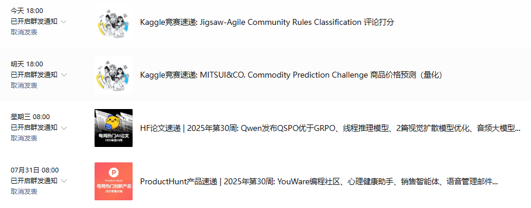
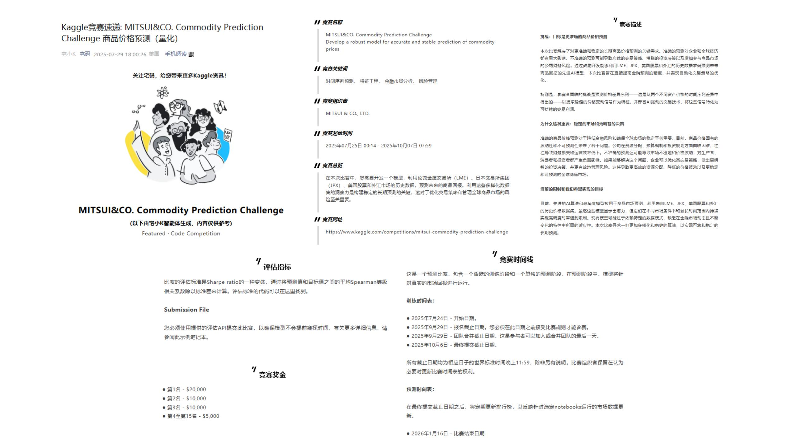
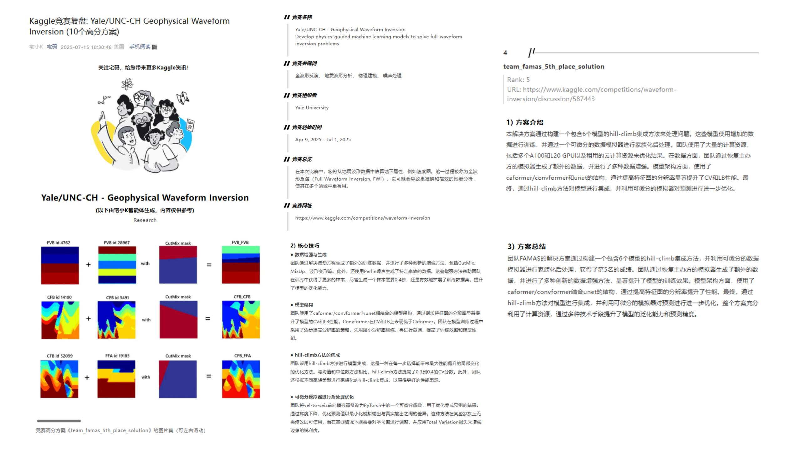
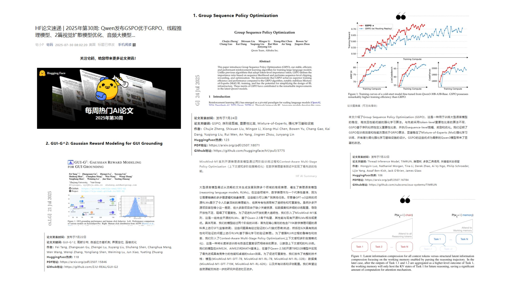
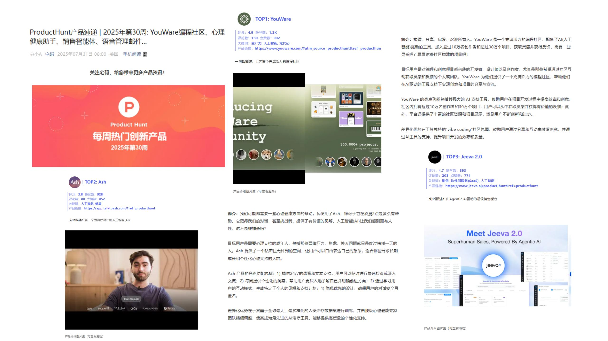

# AICreatorFlow

## 1、背景介绍
从2025年5月底开始，我利用零散时间，做了3个“宅码智能体”：

- **宅小K**：负责“Kaggle竞赛速递”和“竞赛复盘”，帮读者第一时间掌握新比赛动态、复盘高分方案。
- **宅小P**：负责“HuggingFace论文速递”，每周精选热门AI论文并做摘要。
- **宅小A**：负责“ProductHunt产品速递”，每周介绍热门创新产品。

只要我运行它们，就能自动爬取最新资讯、翻译总结、排版生成封面，并把文章放进公众号草稿箱。我要做的，就是审核一下，然后点“发布”。

第一次周末运行代码，看着几篇排版精致的文章静静躺在草稿箱里，那一刻，我真有种“翻身农奴把歌唱”的感觉。



宅小K写的Kaggle竞赛复盘包括：竞赛基础信息、前排高分方案（方案地址、方案介绍、方案图片集、核心技巧、方案总结）。





宅小P写的HF论文速递包括：HuggingFace每周热门论文的信息概要（作者、热度、论文和代码地址）、论文图集、摘要和一句话总结。



宅小A写的ProductHunt产品速递包括：ProductHunt每周热门创新产品的信息概要（关键词、产品官网地址等）、产品介绍图集、简介（目标用户、产品亮点功能和差异化优势）。



## 2、启动服务
使用前，记得到各智能体文件夹内的``configs.py``文件中填补``OUTPUT_ROOT_PATH``、``OPENAI_API_KEY``、``WECHAT_APP_ID``和``WECHAT_APP_SECRET``。
## （1）宅小K
```
cd KaggleAgent

# Kaggle竞赛速览
python .\code\comp_express\pipeline.py

# Kaggle竞赛复盘
python .\code\comp_review\pipeline.py
```

## （2）宅小P
```
# HuggingFace论文速递
cd PaperAgent
python .\code\paper_express\pipeline.py
```

## （3）宅小A
```
# ProductHunt产品速递
cd ProductAgent
python .\code\app_express\pipeline.py
```

## 3、更多
如果如果该开源工作对你有帮助，不妨给我点个Star，感谢你对宅码的持续关注与支持~

整个宅码智能体的项目，只是我最近贪图好玩，做的一个实验，像以上所说，我认为这项目完成度还不是特别高。只要肯花token，肯费心思去做，肯定能做的比现有工作更好。

我把这个项目开源，不是因为它完美，而是希望它能成为一个起点，让更多人站在我的基础上，做出更好、更有价值的东西。开源也是一种邀请。如果你在做内容、做研究、做产品，想尝试用 AI 提升效率，或许你可以从这里开始。如果你有更好的想法，也欢迎和我交流合作。

宅码微信公众号：


个人公众号：


